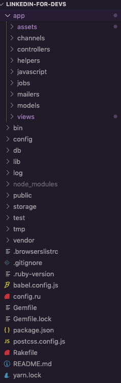

### **back-end para front-enders**

Como fazer seu projeto de forma rápida e prática utilizando Ruby on Rails no back-end

---
@snap[north-west span-50 text-center]
### Sobre mim
@snapend

@snap[east span-50]

@snapend

@snap[west span-50]
Meu nome é Carol, sou desenvolvedora de software (Ruby e Elixir), atualmente me aprofundando no front-end. No meu tempo livre eu faço música. Me acompanhe no twitter, [@carolkarklis](https://twitter.com/carolkarklis)! :)
@snapend
---

@snap[east span-50]

@snapend

@snap[west span-50]
@ul[list-spaced-bullets text-09]
- Convenção ao invés de configuração
- É utilizado por grandes empresas (github, shopify, etc)
- Semântica
- Rápido e prático para pequenos projetos
@ulend
@snapend

---
### **Vamos começar o tutorial**

---

@ul[list-spaced-bullets text-09]
- [Instale o Ruby](#colocar link aqui)
- [Instale o Rails](#colocar link aqui)
@ulend

---
```
rails new nome-do-seu-app
cd nome-do-seu-app
bundle install
rails db:create
```

---


---

**A convenção do MVC (model, view, controller)**

---

😃

@snap[text-pink text-06]
Esse é a pessoa que vai acessar seu site
@snapend

---

😃🔎

@snap[text-pink text-06]
Ela quer ver uma tela específica
@snapend

---


😃🔎 ➡️ view

@snap[text-pink text-06]
A view vai renderizar a informação com o front-end
@snapend

---

😃🔎 ➡️ view ➡️ controller 

@snap[text-pink text-06]
O controller é responsável por passar os dados do back-end pra view. Ele funciona como intermediário.
@snapend

---

😃🔎 ➡️ view ➡️ controller ➡️ model

@snap[text-pink text-06]
O model representa algo relevante no domínio do seu app, e é responsável pelos dados desse domínio. Por exemplo, um produto a ser vendido.
@snapend


---

Resumindo

@ul[list-spaced-bullets text-09]
- O model tem os dados
- O controller pega esses dados e repassa para a view
- A view é a interface final do usuário
@ulend


---

💡 Convenção ao invés de configurar

---

🤔 Mas como a pessoa vai para a view correta?

---

Através das `routes`, elas funcionam como um GPS

---

`http://localhost:3000/products`

@snap[text-pink text-06]
A routes determina que o caminho para encontrar view e controller é "products"
@snapend

---

view de product ➡️ controller de product ➡️ model de product

---

### **Bora fazer esse MVC**

---

```
rails generate scaffold NomeDaClasse campo_um campo_dois campo_tres
```
---

```
rails generate scaffold Product name price photo_url
rails db:migrate
```

---

```
rails s
```

---

`http://localhost:3000/products`

---

### **Bora fazer o front**

---

@ul[list-spaced-bullets text-09]
- view `.erb`
- uso do `<%= %> para utilizar ruby na view`
- pasta assets
@ulend

---

@snap[text-pink]
Obrigada!
@snapend